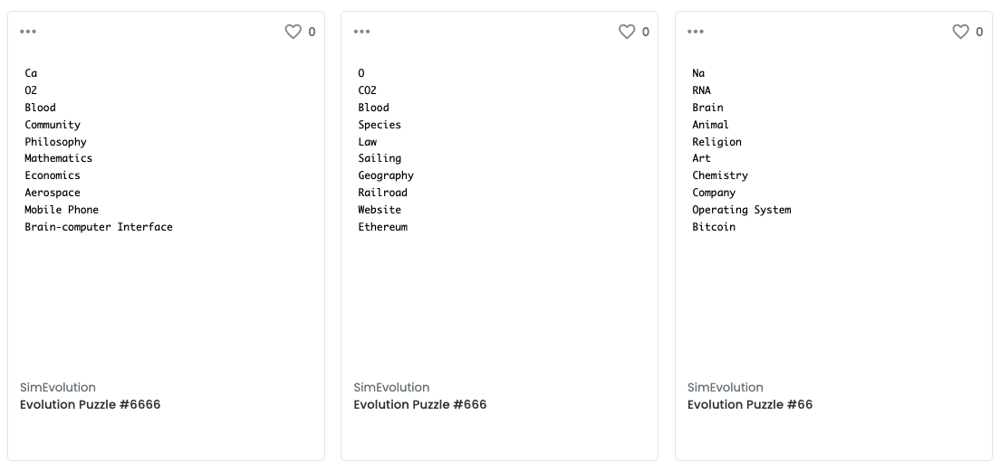

<h1 align="center">模拟演化 Sim Evolution (Alpha)</h1>

## 简介
模拟演化是一个基于区块链的NFT游戏，将各层次上的事物随机生成数据，铸造成演化拼图NFT，尺度从原子到元宇宙，时间从远古到现代，体验演化之旅。目前是一个兴趣导向的实验性项目，也是参加元宇宙集训营的课程项目

## 链接
[在 OpenSea 上浏览](https://opensea.io/collection/simevolution)

[演化2048 Demo](https://bitwater.github.io/SimEvolution/)

[视频简介](https://youtu.be/hUgRrgrLUvA)

合约已部署在 Rinkeby [0x49e0e90064256a92afca34c513925ef3a14026c7](https://rinkeby.etherscan.io/address/0x49e0e90064256a92afca34c513925ef3a14026c7)，Polygon [0x842a3fba4db1fa8dac21eb1fd0b2760e89512606](https://polygonscan.com/address/0x842a3fba4db1fa8dac21eb1fd0b2760e89512606)，待项目更成熟后在主网部署


## 创作理念
游戏创意和设计深受 Sid Meier's Civilization, Maxis Spore 启发，生物、科技和文明演化在电子游戏中是如何设计和展现的。元数据设计和合约开发深受 Dom Hofmann's Loot Project, zeth's Settlements 启发，如何用极简的设计构建一个自下而上和社区驱动的NFT游戏

现实世界根据尺度大小是分成多个层次的，元数据选取了原子、分子、细胞、生物、语言、文明、科学、工业、信息、元宇宙各层次上具有代表性的概念、科技或事物，每一个层次随机生成一个属性数据，组合成 Metadata，铸造成一枚演化拼图NFT



希望这些科学、理论、知识、规律未来在元宇宙中也有记录、映射和呈现。人类在向元宇宙迁徙的过程中，不只是完全沉迷或沉浸于奶头乐的虚拟世界，对于经典的哲学（保安）三问(我是谁？我从哪里来？我要到哪里去？) 也需要有更深刻的认识，激发更多人对现实世界、自身存在、生命演化、科技探索的好奇心和求知欲

前端小游戏[演化2048](https://bitwater.github.io/SimEvolution/)是前端一个玩法，玩家通过玩这个小游戏，在游戏结束时可选择上链数据，铸造成演化拼图NFT，进行NFT的分发，目前只是一个Demo，因为可以无验证直接调用合约 mint 函数，后续对上链数据和关联生成NFT、NFT之间如何互相影响演化需要有更好的机制设计

该创意源自2016年，我受KK【科技想要什么】书中对演化历史革命描写的启发，制作了[2048之演化](http://gooflife.com/2048/)，用2048的极简玩法呈现演化之旅

> 凯文凯利:【科技想要什么】
>> 演化历史上重大革命如下：
>> + 单一可复制分子 → 可复制分子互动群落
>> + 可复制分子 → 由可复制分子串成染色体
>> + RNA酶型染色体 → DNA蛋白质
>> + 无核细胞 → 有核细胞
>> + 无性繁殖（克隆） → 有性重组
>> + 单细胞有机体 → 多细胞有机体
>> + 单一个体 → 群落和超个体
>> + 灵长类群体 → 以语言为基础的群体
>> + 口头传说 → 文字/数学符号
>> + 手稿 → 印刷品
>> + 书本知识 → 科学方法
>> + 手工制造 → 规模化生产
>> + 工业革命 → 无所不在的全球通信
## 工程

项目开发框架基于纯白矩阵的[细胞进化](https://github.com/WhiteMatrixTech/cell-evolution-all) 

### 安装依赖

```bash
cd SimEvolution
```

```bash
yarn
```

### 编译合约
```
yarn compile:contract
```

### 发布合约
```
yarn deploy:contract
```

### 开发dapp
```
yarn start:webapp
```
## 可能的玩法创作
+ 收藏和合成玩法，集齐某一层次或某一条科技链路，如有水、二氧化碳、氧气、碳水化合物可以完成史诗级的光合作用，拼图与拼图之间可进行合成
+ 前端展现多样化，故事、美术、动画创作
+ 点亮演化树，模拟经营类，对各个层次和属性进行细致的数值设计
+ 不同层次有不同的游戏玩法，学习孢子，在细胞世界大鱼吃小鱼，在生物世界是怪物RPG，在部落文明是即时战略，在工业文明之后是策略经营，过程中可以收集到属性、道具进行升级
+ ......